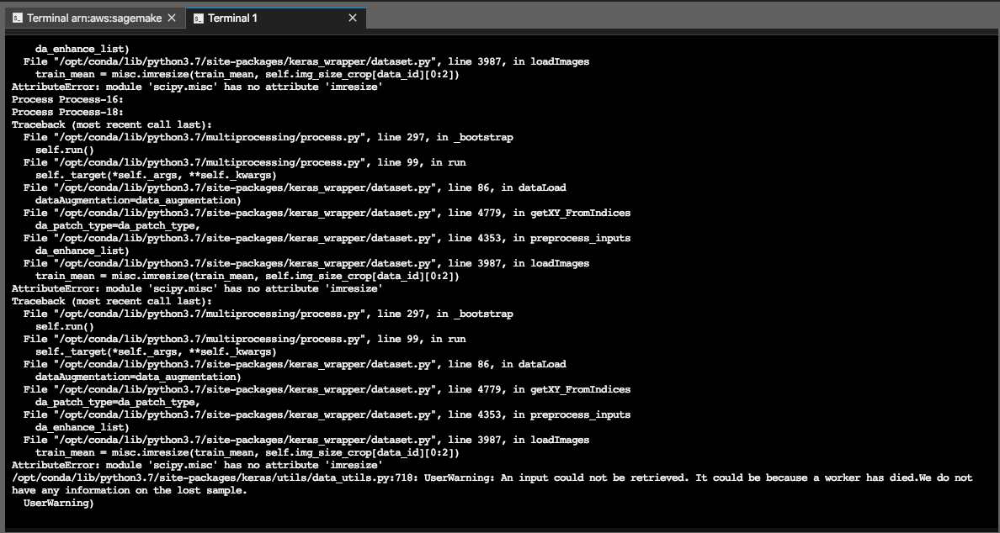

# Information On Each Folder
---

## explore
Helpful information for getting data and labeling. Requried for this particular feature.

- readme.md: links to repos.

- Recipes5k_Scraper.py: Scrapes images.


## modal_keras_detector

In this folder, you'll find the first model I worked on. It is not complete, it
needs to be debugged. The problem is a library issue, it's outdated. Particularly,
from [multimodal_keras_wrapper](https://github.com/MarcBS/multimodal_keras_wrapper).

- train.py: main logic for running the model. In your terminal or AWS, run:
    ```python -u trian.py config_file=config callbacks=callbacks

    ```

- config.py: Contains model parameter/hyper-param configurations. Also the path to the data is defined here.

- prediction.py: logic for testing the trained model. Instead of train, make sure its set to 'predict'. Also, apply
                  this change in the config file.

      ```
      if __name__ == "__main__":

          cf = 'config'
          for arg in sys.argv[1:]:
              k, v = arg.split('=')
              if k == 'config_file':
                  cf = v
          cf = __import__(cf)
          params = cf.load_params()

          if(params['MODE'] == 'predict'):
              logging.info('Running predict.')
              apply_model(params)

          logging.info('Done!')

      ```

- model.py: Logic for creation of several models. Resnet50, InceptionV3, VGG16

- exploratory/data_configs/prep_data.py: Logic for building and preprocessing the data.

- exploratory/data/images: Where the actual image data is stored.
---

## Issues with this Model

Assuming you've properly structured your data and have all the necessary libraries
installed, when running the model, you'll recieve this error:



This needs to be solved. It is getting an error when trying to augment the images.
---

## utils

Two python files, each with helpful functions to be used during model creation or when setting up the endpoints.

- base_six4.py: base64 for images. Needs to be done for frontend.

- helper_func.py: multiple functions. Such as converting a dictionary to a pickle file, plotting images, tensors, among other things.
---

## yolo_detector

I work in progress model, using yolo and darknet.

- detect_images.py: Contains the logic for one of my the endpoints for this feature. Check the file for further descriptions on what it does.

- detect_json.py: Second endpoint for this feature.

- yolo_model/yolo_model.py: Logic for the model.

- yolo_model/yolo_utils: Utilities for the yolo model.

- yolo_model/yolo_dataset: data pre-processing for the model.
