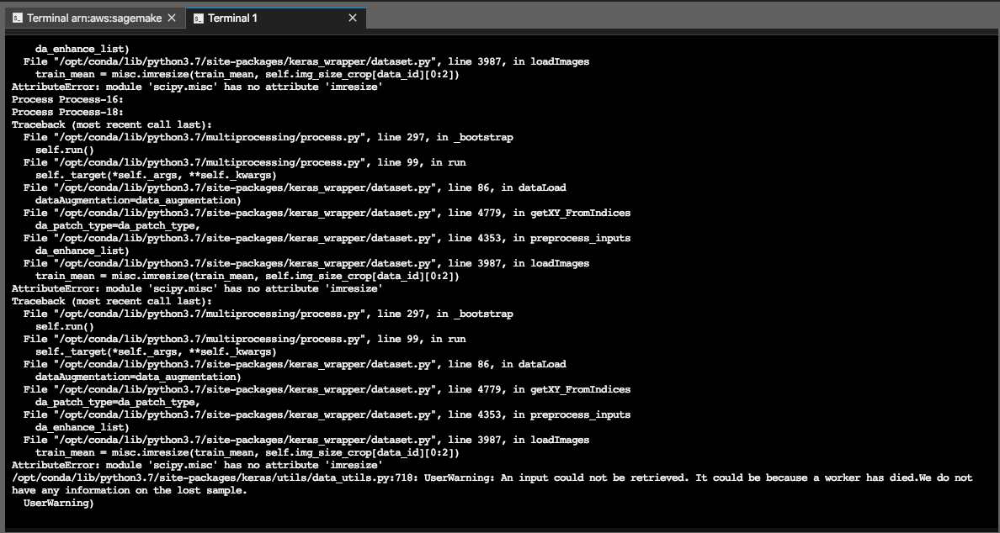
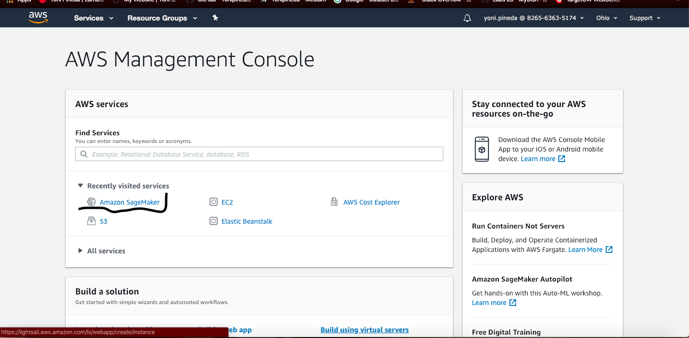
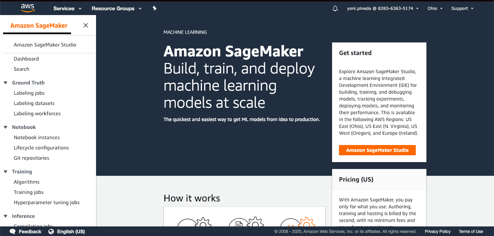
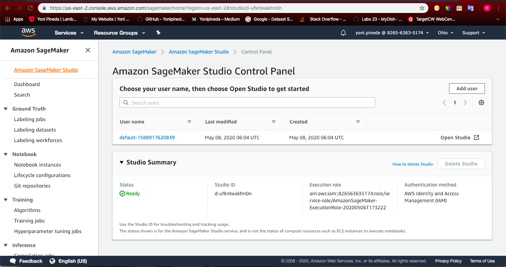

# Information On Each Folder
---

## explore
Helpful information for getting data and labeling. Requried for this particular feature.

- [readme.md](explore/readme.md): links to repos.

- [Recipes5k_Scraper.py](explore/Recipes5k_Scraper.py): Scrapes images.


## imgs

- Pictures for this readme.md, specifically for the [How to utilize Sagemaker](# How to utilize Sagemaker)

---

## modal_keras_detector

In this folder, you'll find the first model I worked on. It is not complete, it
needs to be debugged. The problem is a library issue, it's outdated. Particularly,
from [multimodal_keras_wrapper](https://github.com/MarcBS/multimodal_keras_wrapper).

- [train.py](modal_keras_detector/train.py): main logic for running the model. In your terminal or AWS, run:
    ```
    python -u trian.py config_file=config callbacks=callbacks
    ```

- [config.py](modal_keras_detector/config.py): Contains model parameter/hyper-param configurations. Also the path to the data is defined here.

- [prediction.py](modal_keras_detector/prediction.py): logic for testing the trained model. Instead of train, make sure its set to 'predict'. Also, apply
                  this change in the config file.

      ```
      if __name__ == "__main__":

          cf = 'config'
          for arg in sys.argv[1:]:
              k, v = arg.split('=')
              if k == 'config_file':
                  cf = v
          cf = __import__(cf)
          params = cf.load_params()

          if(params['MODE'] == 'predict'):
              logging.info('Running predict.')
              apply_model(params)

          logging.info('Done!')

      ```

- [model.py](modal_keras_detector/model.py): Logic for creation of several models. Resnet50, InceptionV3, VGG16

- [exploratory/data_configs/prep_data.py](modal_keras_detector/exploratory/data_configs/prep_data.py): Logic for building and preprocessing the data.

- [exploratory/data/images](modal_keras_detector/exploratory/data/images): Where the actual image data is stored.
---

## Issues with this Model

Assuming you've properly structured your data and have all the necessary libraries
installed, when running the model, you'll recieve this error:




This needs to be solved. It is getting an error when trying to augment the images.

---

## utils

Two python files, each with helpful functions to be used during model creation or when setting up the endpoints.

- [base_six4.py](utils/base_six4.py): base64 for images. Needs to be done for frontend.

- [helper_func.py](utils/helper_func.py): multiple functions. Such as converting a dictionary to a pickle file, plotting images, tensors, among other things.
---

##  wandb_cnn_detector

Third model. A work in progress.

- [config_cnn.py](wandb_cnn_detector/config_cnn.py): Work in progress configuration for this model. Use the .yml file instead.

- [model_cnn.py](wandb_cnn_detector/model_cnn.py): Main logic for the model.

- [readme.md](wandb_cnn_detector/readme.md): ReadMe file for this particular model. Info on wanb.

- [sweep_cnn_model.yml](wandb_cnn_detector/sweep_cnn_model.yml): Configuration file for hyper-parameter tuning.

- [data/build_data/dataset_builder.py](wandb_cnn_detector/data/build_data/dataset_builder.py): Logic for dictionary to pickle conversion.

- [data/Dataset_Food_Recipes5k_complete.pkl](wandb_cnn_detector/data/Dataset_Food_Recipes5k_complete.pkl): Pikle file for loading into the model.


## yolo_detector

A work in progress model, using yolo and darknet.

- [detect_images.py](yolo_detector/detect_images.py): Contains the logic for one of my the endpoints for this feature. Check the file for further descriptions on what it does.

- [detect_json.py](yolo_detector/detect_json.py): Second endpoint for this feature.

- [yolo_model/yolo_model.py](yolo_detector/yolo_model/yolo_model.py): Logic for the model.

- [yolo_model/yolo_utils](yolo_detector/yolo_model/yolo_utils.py): Utilities for the yolo model.

- [yolo_model/yolo_dataset](yolo_detector/yolo_model/yolo_dataset.py): data pre-processing for the model.

---

# How to utilize Sagemaker

1. With your MyDish AWS account, log in and go to the Management console:

    

    Click on "Amazon SageMaker".


2.  In the SageMaker Console:

    

    Click on "Amazon SageMaker Studio".


3. You'll see an "Open Studio" option, click on it:

    


4. And, you'll see a very famaliar layout:

    

    You have the option to open up a jupyter notebook or work as if you are working in a text editor/terminal.
    You also have GPU options, among other things. Pretty sweet. Make sure to check the cost when ever using anything in AWS.
