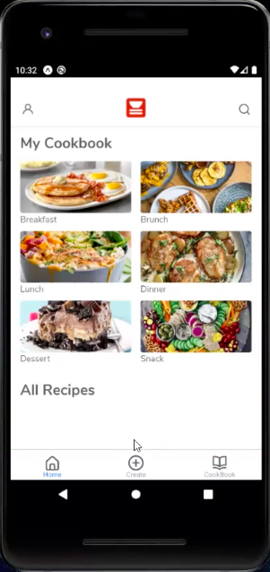

# 🍔 MyDish

🍽 A source-control cooking app built in React Native which allows users to quickly make and see changes to their recipe. ​ You can find the deployed project on the Google Play Store for Android devices or via TestFlight for iOS devices. ​ TestFlight Instructions:

- Search for TestFlight in the App Store.
- Once installed, follow this link.

Below will fo a description of the features along with a gif animation of the feature. Lets see if it works. . .

## Content
- [Project Overview](#Project-Overview)
  - [Installation and Set-Up](#Installation-and-Set-Up)
  - [Git WorkFlow](#Git-WorkFlow)
  - [Contributors](#Contributors)
  - [Project Guide](#Project-Guide)
  - [Tech Stack](#Tech-Stack)
- [API Overview](#API-Overview)
  - [Architecture](#Architecture)
  - [Endpoints](#Endpoints)
  - [AWS Guide](#AWS-Guide)
  - [Local Testing](#Local-Testing)
  - [WEB Documentation](#WEB-Documentation)
- [Extra Information](#Extra-Information)
  - [Contributing](#Contributing)
  - [Issue/Bug Request](#Issue-Bug-Request)
  - [Feature Requests](#Feature-Requests)
  - [Pull Requests](#Pull-Requests)
  - [Pull Request Guidelines](#Pull-Request-Guidelines)
  - [Attribution](#Attribution)

## Project Overview

### Installation and Set-Up

#### Step 1: Clone the master branch repo into your local machine
> git clone https://github.com/Lambda-School-Labs/MyDish-DS.git

#### Step 2: Install the virtual env on the main MyDish Directory,
It should be the directory containing the pipfile and pipfile.lock.
Once you're in that directory, install the packages.
> pipenv install

#### Other options: Install using the requirements.txt file
> pipenv install -r requirements.txt

Note: If it does not install, it is most likely due to an out-dated package.
Check the versions of the packages, delete if not needed, or specify the versions.

#### Step 3: Open the env
> pipenv shell

#### Additional Step:  Creating a conda env using requirements.txt

#### Create the conda environment and specify python version(3.7):
> conda create -n mydish python==3.7

#### Activate the newly created env:
> conda activate mydish

#### Install the requirements.txt file:
> pip install -r requirements.txt

#### Install kernel specification:
> python -m ipykernel install --user --name mydish

#### Now you can deactivate the env and start using jupyter notebooks/lab:
> conda deactivate

and, open up a notebook.

#### To install or uninstall packages, open up the env:
> conda activate MyDish

#### Then, install or uninstall a package
> conda install/uninstall some_package

Useful [Lambda Lecture](https://www.youtube.com/watch?v=_VGKzkAEvU0&feature=youtu.be) on how to do this.

Note: Link may not work. If so, refer to the tool-kit in unit-4/sprint-1/day-1 and look for the DS11 Lecture video.

### Git WorkFlow
All developmental code should be pushed to the 'staging' branch, not masters.
Follow the Semantic Commits format for [Commit Messages](https://gist.github.com/joshbuchea/6f47e86d2510bce28f8e7f42ae84c716)

#### Step 1: Make sure you're on the master branch
> git branch

#### Step 2: Create the staging branch in your local machine
> git checkout -b staging

#### Step 3: If there is an existing staging branch on the github repo, pull
> git pull origin staging

#### Step 4: Set staging branch to track master branch
> git branch --set-upstream-to=origin/master staging

#### Step 5: During Development, push code to staging until api is ready for deployment.
> git push origin staging

Some extra tips on Git WorkFlow:

You can consider the staging branch as working code thats in development. In a team,
you don't want everyone pushing to staging because that can create merge conflicts.
Instead, create another branch that tracks staging, push with your new branch and
request a team member to review your code and merge with staging. This also applies
with staging and masters.

#### From staging, create another branch:
> git checkout -b feature/new_branch

#### Track staging:
> git branch --set-upstream-to=origin/staging feature/new_branch

#### Push the feature branch with your added modifications and request a review:
> git push origin HEAD or git push origin feature/new_branch

Once its been reviewed and merged, you can delete the branch in the Github Repo and
in your local machine by:

#### Leave the branch by checking into staging
> git checkout staging

#### Delete the feature branch
>git branch -d feature/new_branch or git branch -D feature/new_branch

#### Pull the new changes in the staging branch
> git pull origin HEAD or git pull origin staging

There are more commands you can use for Git, checkout some of these resourses:

🧩 [Atlassian](https://www.atlassian.com/git/tutorials/comparing-workflows)

### Contributors

🤖 Labs 21 Contributors

|                                              [Todd Gonzalez](https://github.com/ToddMG)                                               |                                          [Scott Lightfoot](https://github.com/ScottLightfoot)                                          |                                              [John Wesley](https://github.com/johnwesleyharding)                                              |                                                                            |
| :----------------------------------------------------------------------------------------------------------------------------------: | :-----------------------------------------------------------------------------------------------------------------------------: | :-----------------------------------------------------------------------------------------------------------------------------------: | :----------------------------------------------------------------------------------------------------------------------------------: |
|                  |         |                 |  
|                                                   |                                           |                                                   |
|  |  |  |

🤖 Labs 23 Contributors

|                                              [Neal Whitlock](https://github.com/NealWhitlock)                                               |                                          [Robin Srimal](https://github.com/RobinSrimal)                                          |                                              [Yoni Pineda](https://github.com/Yonipineda)                                              |                                                                                 |
| :----------------------------------------------------------------------------------------------------------------------------------: | :-----------------------------------------------------------------------------------------------------------------------------: | :-----------------------------------------------------------------------------------------------------------------------------------: | :----------------------------------------------------------------------------------------------------------------------------------: |
|                  |         |                 |      
|                                                   |                                           |                                                   |    
|  |  |  |

### Project Guide
Helpful Resources

Note: Ask your TL or SL for access to Notion and/or Trello.

📜 [Trello Board](https://trello.com/b/EOPvgi1r/mydish-labs)

♻️ [Product Canvas](https://www.notion.so/f1b05a1a0f1a4b648d3a50bb25319d41?v=3b36ae1ea1744146b3147a8e2f9dc043)

📡 [Deployed Front End](http://mydish-ingredientprediction.eba-wmm2grnv.us-east-2.elasticbeanstalk.com/)

🧾 [Product Engineering](https://www.notion.so/Product-Engineering-1bf2a76e1f124e55bc5e14a0a8f0ca3e)

🧪 [Labs Guide](https://lambda-school-labs.github.io/labs-guides/)

🛠 [Labs Engineering Standards](https://lambda-school-labs.github.io/labs-engineering-standards/)

📈 [Labs DS Tips](https://lambda-school-labs.github.io/ds/)

### Tech Stack

🐍 [Python 3.7](https://www.python.org/downloads/release/python-374/)

⚡️ [Flask](https://flask.palletsprojects.com/en/1.1.x/)

🔍 [Google Vision API](https://cloud.google.com/vision/docs)

🥜 [AWS ElasticBeanstalk](https://aws.amazon.com/elasticbeanstalk/)

## API Overview

### Architecture
Not Yet Implemented.

### Endpoints

There is only one current deployed version which can be found locally in the Dishify/ Directory.

[Deployed AWS Endpoint](https://3z6kv0n0v6.execute-api.us-east-2.amazonaws.com/test/dishify)

### AWS Guide

To use this endpoint, give the api an image url, like this [one](https://cdn.shopify.com/s/files/1/1133/5284/products/9781771644761_002_iart.jpg):

#### After /dishify, in the url, add ?imageURL=:
> https://3z6kv0n0v6.execute-api.us-east-2.amazonaws.com/test/dishify?imageURL=

#### And, give it a url of an image with text:
> https://3z6kv0n0v6.execute-api.us-east-2.amazonaws.com/test/dishify?imageURL=https://cdn.shopify.com/s/files/1/1133/5284/products/9781771644761_002_iart.jpg

### Local Testing

On running the API locally using [Flask](https://flask.palletsprojects.com/en/1.1.x/) and the [Unittests](https://docs.python.org/3/library/unittest.html):

#### Run the API locally

If not in the API/ directory:
> cd APi/

Run app.py:
> python app.py

#### Execute the unittests
> python -m unittest discover

### WEB Documentation

See [Backend Documentation](https://github.com/Lambda-School-Labs/mydish-be/blob/master/README.md) for details on the backend of our project.

See [Front End Documentation](https://github.com/Lambda-School-Labs/mydish-fe/blob/master/README.md) for details on the front end of our project.

## Extra Information

### Contributing

When contributing to this repository, please first discuss the change you wish to make via issue, email, or any other method with the owners of this repository before making a change.

Please note we have a [code of conduct](./code_of_conduct.md.md). Please follow it in all your interactions with the project.

### Issue Bug Request

 **If you are having an issue with the existing project code, please submit a bug report under the following guidelines:**
 - Check first to see if your issue has already been reported.
 - Check to see if the issue has recently been fixed by attempting to reproduce the issue using the latest master branch in the repository.
 - Create a live example of the problem.
 - Submit a detailed bug report including your environment & browser, steps to reproduce the issue, actual and expected outcomes,  where you believe the issue is originating from, and any potential solutions you have considered.

### Feature Requests

We would love to hear from you about new features which would improve this app and further the aims of our project. Please provide as much detail and information as possible to show us why you think your new feature should be implemented.

### Pull Requests

If you have developed a patch, bug fix, or new feature that would improve this app, please submit a pull request. It is best to communicate your ideas with the developers first before investing a great deal of time into a pull request to ensure that it will mesh smoothly with the project.

Remember that this project is licensed under the MIT license, and by submitting a pull request, you agree that your work will be, too.

### Pull Request Guidelines

- Ensure any install or build dependencies are removed before the end of the layer when doing a build.
- Update the README.md with details of changes to the interface, including new plist variables, exposed ports, useful file locations and container parameters.
- Ensure that your code conforms to our existing code conventions and test coverage.
- Include the relevant issue number, if applicable.
- You may merge the Pull Request in once you have the sign-off of two other developers, or if you do not have permission to do that, you may request the second reviewer to merge it for you.

### Attribution

These contribution guidelines have been adapted from [this good-Contributing.md-template](https://gist.github.com/PurpleBooth/b24679402957c63ec426).
