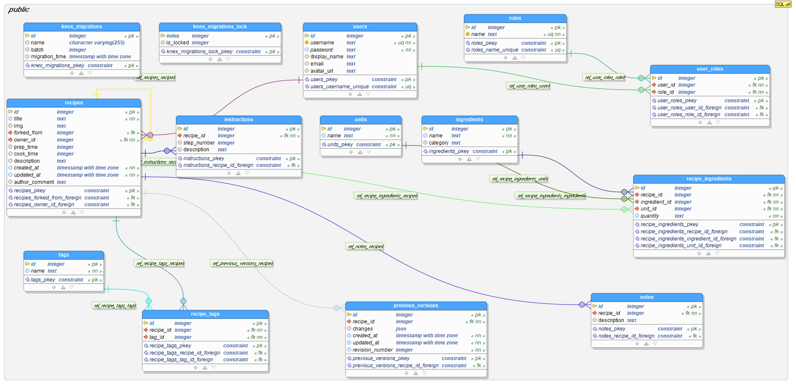

# 🍔 MyDish

🍽 A source-control cooking app built in React Native which allows users to quickly make and see changes to their recipe. ​ You can find the deployed project on the [Google Play Store](https://play.google.com/store/apps/details?id=com.lambdaschool.mydish) for Android devices or via [TestFlight](https://apps.apple.com/us/app/testflight/id899247664) for iOS devices. ​ TestFlight Instructions:

- Search for TestFlight in the App Store.
- Once installed, follow this [link](https://apps.apple.com/us/app/testflight/id899247664).

- For information on the endpoints deployed to AWS, refer to the [API Overview](#API-Overview) section of this readme.
- For a visualization of the deployed features, refer to [Feature Gif Animation](#Feature-Gif-Animation)

## Content
- [Project Overview](#Project-Overview)
  - [Installation and Set-Up](#Installation-and-Set-Up)
  - [Git WorkFlow](#Git-WorkFlow)
  - [Contributors](#Contributors)
  - [Project Guide](#Project-Guide)
  - [Tech Stack](#Tech-Stack)
- [API Overview](#API-Overview)
  - [Architecture](#Architecture)
  - [Endpoints](#Endpoints)
  - [Feature Gif Animation](#Feature-Gif-Animation)
  - [Presentation Recordings](#Presentation-Recordings)
  - [Local Testing](#Local-Testing)
  - [Future deployment on AWS Elastic Beanstalk](#Future-deployment-on-AWS-Elastic-Beanstalk)
  - [WEB Documentation](#WEB-Documentation)
- [Extra Information](#Extra-Information)
  - [Contributing](#Contributing)
  - [Issue/Bug Request](#Issue-Bug-Request)
  - [Feature Requests](#Feature-Requests)
  - [Pull Requests](#Pull-Requests)
  - [Pull Request Guidelines](#Pull-Request-Guidelines)
  - [Attribution](#Attribution)

## Project Overview

### Installation and Set-Up

#### Step 1: Clone the master branch repo into your local machine
> git clone https://github.com/Lambda-School-Labs/MyDish-DS.git

#### Step 2: Install using the requirements.txt file
It should be the directory containing the requirements.txt file.
Once you're in that directory, install the packages.
> pipenv install -r requirements.txt

Note: To run on windows locally, go to the [requirements_windows_locally](Dishify/app/requirements_windows_locally) for the requirements.txt file.

#### Step 3: Open the env
> pipenv shell

#### Additional Step:  Creating a conda env using requirements.txt

#### Create the conda environment and specify python version(3.7):
> conda create -n mydish python==3.7

#### Activate the newly created env:
> conda activate mydish

#### Install the requirements.txt file:
> pip install -r requirements.txt

#### Install kernel specification:
> python -m ipykernel install --user --name mydish

#### Now you can deactivate the env and start using jupyter notebooks/lab:
> conda deactivate

and, open up a notebook.

#### To install or uninstall packages, open up the env:
> conda activate MyDish

#### Then, install or uninstall a package
> conda install/uninstall some_package

Useful [Lambda Lecture](https://www.youtube.com/watch?v=_VGKzkAEvU0&feature=youtu.be) on how to do this.

Note: Link may not work. If so, refer to the tool-kit in unit-4/sprint-1/day-1 and look for the DS11 Lecture video.

---

### Git WorkFlow
All developmental code should be pushed to the 'staging' branch, not masters.
Follow the Semantic Commits format for [Commit Messages](https://gist.github.com/joshbuchea/6f47e86d2510bce28f8e7f42ae84c716)

#### Step 1: Make sure you're on the master branch
> git branch

#### Step 2: Create the staging branch in your local machine
> git checkout -b staging

#### Step 3: If there is an existing staging branch on the github repo, pull
> git pull origin staging

#### Step 4: Set staging branch to track master branch
> git branch --set-upstream-to=origin/master staging

#### Step 5: During Development, push code to staging until api is ready for deployment.
> git push origin staging

Some extra tips on Git WorkFlow:

You can consider the staging branch as working code thats in development. In a team,
you don't want everyone pushing to staging because that can create merge conflicts.
Instead, create another branch that tracks staging, push with your new branch and
request a team member to review your code and merge with staging. This also applies
with staging and masters.

#### From staging, create another branch:
> git checkout -b feature/new_branch

#### Track staging:
> git branch --set-upstream-to=origin/staging feature/new_branch

#### Push the feature branch with your added modifications and request a review:
> git push origin HEAD or git push origin feature/new_branch

Once its been reviewed and merged, you can delete the branch in the Github Repo and
in your local machine by:

#### Leave the branch by checking into staging
> git checkout staging

#### Delete the feature branch
>git branch -d feature/new_branch or git branch -D feature/new_branch

#### Pull the new changes in the staging branch
> git pull origin HEAD or git pull origin staging

There are more commands you can use for Git, checkout some of these resourses:

🧩 [Atlassian](https://www.atlassian.com/git/tutorials/comparing-workflows)

---

### Contributors

🤖 Labs 21 Contributors

|                                              [Todd Gonzalez](https://github.com/ToddMG)                                               |                                          [Scott Lightfoot](https://github.com/ScottLightfoot)                                          |                                              [John Wesley](https://github.com/johnwesleyharding)                                              |                                                                            |
| :----------------------------------------------------------------------------------------------------------------------------------: | :-----------------------------------------------------------------------------------------------------------------------------: | :-----------------------------------------------------------------------------------------------------------------------------------: | :----------------------------------------------------------------------------------------------------------------------------------: |
|                  |         |                 |  
|                                                   |                                           |                                                   |
|  |  |  |

🤖 Labs 23 Contributors

|                                              [Neal Whitlock](https://github.com/NealWhitlock)                                               |                                          [Robin Srimal](https://github.com/RobinSrimal)                                          |                                              [Yoni Pineda](https://github.com/Yonipineda)                                              |                                                                                 |
| :----------------------------------------------------------------------------------------------------------------------------------: | :-----------------------------------------------------------------------------------------------------------------------------: | :-----------------------------------------------------------------------------------------------------------------------------------: | :----------------------------------------------------------------------------------------------------------------------------------: |
|                  |         |                 |      
|                                                   |                                           |                                                   |    
|  |  |  |

---

### Project Guide
Helpful Resources

Note: Ask your TL or SL for access to Notion and/or Trello.

📜 [Trello Board](https://trello.com/b/EOPvgi1r/mydish-labs)

♻️ [Product Canvas](https://www.notion.so/f1b05a1a0f1a4b648d3a50bb25319d41?v=3b36ae1ea1744146b3147a8e2f9dc043)

📡 [Deployed Front End](http://mydish-ingredientprediction.eba-wmm2grnv.us-east-2.elasticbeanstalk.com/)

🧾 [Product Engineering](https://www.notion.so/Product-Engineering-1bf2a76e1f124e55bc5e14a0a8f0ca3e)

🧪 [Labs Guide](https://lambda-school-labs.github.io/labs-guides/)

🛠 [Labs Engineering Standards](https://lambda-school-labs.github.io/labs-engineering-standards/)

📈 [Labs DS Tips](https://lambda-school-labs.github.io/ds/)

---

### Tech Stack

[Python 3.7](https://www.python.org/downloads/release/python-374/)

[FastAPI](https://fastapi.tiangolo.com/)

[Google Vision API](https://cloud.google.com/vision/docs)

[AWS ElasticBeanstalk](https://aws.amazon.com/elasticbeanstalk/)

---

## API Overview

### Architecture

#### API Architecture
Not Yet Implemented.

#### Database Schema

---

### Endpoints
You can test the labs23 endpoints via fastapi docs:
[Endpoints](http://dishify2605-env.eba-vdmixjfd.us-east-1.elasticbeanstalk.com/docs)

A labs21 endpoint has not yet been (as of 28.05.2020) integrated in the labs23 API but is connected to the app itself and hosted on AWS Elastic Beanstalk east 2:
[Ingredient Predictor](http://mydish-ingredientprediction.eba-wmm2grnv.us-east-2.elasticbeanstalk.com/)

In addition the labs21 team created a clone of the backend and hosted it on AWS east 2. It is currently (28.05.2020) not in use but functional:
[Backend clone](http://mydish-be.us-east-2.elasticbeanstalk.com/)

---

### Feature Gif Animation

#### Ingredient Getter

  After a user enters a recipe name this feature queries a database of recipes to find all recipes with titles that include words in the entered name. The ingredients are then compared across these matching recipes. Only those ingredients that appear in excess of 25% of recipes are returned. For each ingredient the most common quantity and unit associated with the ingredient are also returned.

  

#### Recipe Getter

  Copy and paste the url of a recipe you would like to add to your cookbook in the app.

  

  The ingredients and instruction will be added automatically with the press of a button.

  

#### Recipe Parser

  Upload a picture of the ingredients and/or the instructions of a recipe you like (from a cookbook or even handwritten notes) and the content will be saved automatically to your cookbook. This works for several languages. Especially well for Spanish, French and English.

  

---

### Presentation Recordings

##### The Labs23 DataScience Team Recording

##### The Labs23 MyDish Shark Tank Demo

---

### Local Testing

Run the api locally using [Fastapi](https://fastapi.tiangolo.com/):

#### Run the API locally

Go to the directory of the app:
> cd Dishify/app/

Run application.py  with uvicorn:
> uvicorn application:app --reload

---

### Future deployment on AWS Elastic Beanstalk

If a future labs team decides to deploy an iteration of the API please consider this [medium article](https://medium.com/@robin.srimal/how-to-fix-a-413-request-entity-too-large-error-on-aws-elastic-beanstalk-ac2bb15f244d) when confronted with a "413 request entity too large error". It provides detailed instructions on how to configure the nginx server.

---

### WEB Documentation

See [Backend Documentation](https://github.com/Lambda-School-Labs/mydish-be/blob/master/README.md) for details on the backend of our project.

See [Front End Documentation](https://github.com/Lambda-School-Labs/mydish-fe/blob/master/README.md) for details on the front end of our project.

---

## Extra Information

### Contributing

When contributing to this repository, please first discuss the change you wish to make via issue, email, or any other method with the owners of this repository before making a change.

Please note we have a [code of conduct](./code_of_conduct.md.md). Please follow it in all your interactions with the project.

---

### Issue Bug Request

 **If you are having an issue with the existing project code, please submit a bug report under the following guidelines:**
 - Check first to see if your issue has already been reported.
 - Check to see if the issue has recently been fixed by attempting to reproduce the issue using the latest master branch in the repository.
 - Create a live example of the problem.
 - Submit a detailed bug report including your environment & browser, steps to reproduce the issue, actual and expected outcomes,  where you believe the issue is originating from, and any potential solutions you have considered.

### Feature Requests

We would love to hear from you about new features which would improve this app and further the aims of our project. Please provide as much detail and information as possible to show us why you think your new feature should be implemented.

### Pull Requests

If you have developed a patch, bug fix, or new feature that would improve this app, please submit a pull request. It is best to communicate your ideas with the developers first before investing a great deal of time into a pull request to ensure that it will mesh smoothly with the project.

Remember that this project is licensed under the MIT license, and by submitting a pull request, you agree that your work will be, too.

### Pull Request Guidelines

- Ensure any install or build dependencies are removed before the end of the layer when doing a build.
- Update the README.md with details of changes to the interface, including new plist variables, exposed ports, useful file locations and container parameters.
- Ensure that your code conforms to our existing code conventions and test coverage.
- Include the relevant issue number, if applicable.
- You may merge the Pull Request in once you have the sign-off of two other developers, or if you do not have permission to do that, you may request the second reviewer to merge it for you.

### Attribution

These contribution guidelines have been adapted from [this good-Contributing.md-template](https://gist.github.com/PurpleBooth/b24679402957c63ec426).
